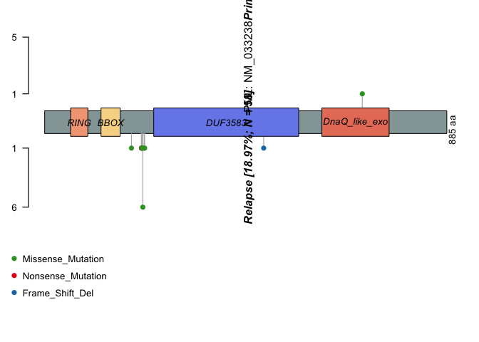

SECTION 6: Reading and Summarizing MAF Files

The input files for reading/summarizing MAF files are a MAF file (can be
gz compressed), an optional clinical data associated with each sample,
and an optional copy number data file. In this section, we read the MAF
file and viewed the sample summary, the gene summary, the clinical data,
and the fields.

``` r
# 6.2: Reading MAF files
library(maftools)
clinical.data = read.table("tcga_laml_annot.tsv",sep
                           ="\t", header = TRUE) #read in metadata
laml = read.maf(maf = "tcga_laml.maf", clinicalData = clinical.data) #create a MAF object
```

    ## -Reading
    ## -Validating
    ## -Silent variants: 475 
    ## -Summarizing
    ## -Processing clinical data
    ## -Finished in 0.177s elapsed (0.172s cpu)

``` r
relapse.apl = read.maf(maf = "APL_primary.maf")
```

    ## -Reading
    ## -Validating
    ## --Non MAF specific values in Variant_Classification column:
    ##   ITD
    ## -Silent variants: 45 
    ## -Summarizing
    ## -Processing clinical data
    ## --Missing clinical data
    ## -Finished in 0.053s elapsed (0.051s cpu)

``` r
APL_relapse.maf = read.maf(maf = "APL_relapse.maf")
```

    ## -Reading
    ## -Validating
    ## --Non MAF specific values in Variant_Classification column:
    ##   ITD
    ## -Silent variants: 19 
    ## -Summarizing
    ## -Processing clinical data
    ## --Missing clinical data
    ## -Finished in 0.034s elapsed (0.033s cpu)

``` r
brca = read.maf(maf = "brca.maf")
```

    ## -Reading
    ## -Validating
    ## -Silent variants: 1882 
    ## -Summarizing
    ## -Processing clinical data
    ## --Missing clinical data
    ## -Finished in 0.029s elapsed (0.028s cpu)

``` r
# 6.3: MAF Object
laml
```

    ## An object of class  MAF 
    ##                    ID          summary  Mean Median
    ##  1:        NCBI_Build               37    NA     NA
    ##  2:            Center genome.wustl.edu    NA     NA
    ##  3:           Samples              193    NA     NA
    ##  4:            nGenes             1241    NA     NA
    ##  5:   Frame_Shift_Del               52 0.269      0
    ##  6:   Frame_Shift_Ins               91 0.472      0
    ##  7:      In_Frame_Del               10 0.052      0
    ##  8:      In_Frame_Ins               42 0.218      0
    ##  9: Missense_Mutation             1342 6.953      7
    ## 10: Nonsense_Mutation              103 0.534      0
    ## 11:       Splice_Site               92 0.477      0
    ## 12:             total             1732 8.974      9

``` r
getSampleSummary(laml)
```

    ##      Tumor_Sample_Barcode Frame_Shift_Del Frame_Shift_Ins In_Frame_Del
    ##   1:         TCGA-AB-3009               0               5            0
    ##   2:         TCGA-AB-2807               1               0            1
    ##   3:         TCGA-AB-2959               0               0            0
    ##   4:         TCGA-AB-3002               0               0            0
    ##   5:         TCGA-AB-2849               0               1            0
    ##  ---                                                                  
    ## 189:         TCGA-AB-2942               0               0            0
    ## 190:         TCGA-AB-2946               0               0            0
    ## 191:         TCGA-AB-2954               0               0            0
    ## 192:         TCGA-AB-2982               0               0            0
    ## 193:         TCGA-AB-2903               0               0            0
    ##      In_Frame_Ins Missense_Mutation Nonsense_Mutation Splice_Site total
    ##   1:            1                25                 2           1    34
    ##   2:            0                16                 3           4    25
    ##   3:            0                22                 0           1    23
    ##   4:            0                15                 1           5    21
    ##   5:            0                16                 1           2    20
    ##  ---                                                                   
    ## 189:            1                 0                 0           0     1
    ## 190:            0                 1                 0           0     1
    ## 191:            0                 1                 0           0     1
    ## 192:            0                 1                 0           0     1
    ## 193:            0                 0                 0           0     0

``` r
getGeneSummary(laml)
```

    ##       Hugo_Symbol Frame_Shift_Del Frame_Shift_Ins In_Frame_Del In_Frame_Ins
    ##    1:        FLT3               0               0            1           33
    ##    2:      DNMT3A               4               0            0            0
    ##    3:        NPM1               0              33            0            0
    ##    4:        IDH2               0               0            0            0
    ##    5:        IDH1               0               0            0            0
    ##   ---                                                                      
    ## 1237:      ZNF689               0               0            0            0
    ## 1238:      ZNF75D               0               0            0            0
    ## 1239:      ZNF827               1               0            0            0
    ## 1240:       ZNF99               0               0            0            0
    ## 1241:        ZPBP               0               0            0            0
    ##       Missense_Mutation Nonsense_Mutation Splice_Site total MutatedSamples
    ##    1:                15                 0           3    52             52
    ##    2:                39                 5           6    54             48
    ##    3:                 1                 0           0    34             33
    ##    4:                20                 0           0    20             20
    ##    5:                18                 0           0    18             18
    ##   ---                                                                     
    ## 1237:                 1                 0           0     1              1
    ## 1238:                 1                 0           0     1              1
    ## 1239:                 0                 0           0     1              1
    ## 1240:                 1                 0           0     1              1
    ## 1241:                 1                 0           0     1              1
    ##       AlteredSamples
    ##    1:             52
    ##    2:             48
    ##    3:             33
    ##    4:             20
    ##    5:             18
    ##   ---               
    ## 1237:              1
    ## 1238:              1
    ## 1239:              1
    ## 1240:              1
    ## 1241:              1

``` r
getClinicalData(laml)
```

    ##      Tumor_Sample_Barcode FAB_classification days_to_last_followup
    ##   1:         TCGA-AB-2802                 M4                   365
    ##   2:         TCGA-AB-2803                 M3                   792
    ##   3:         TCGA-AB-2804                 M3                  2557
    ##   4:         TCGA-AB-2805                 M0                   577
    ##   5:         TCGA-AB-2806                 M1                   945
    ##  ---                                                              
    ## 189:         TCGA-AB-3007                 M3                  1581
    ## 190:         TCGA-AB-3008                 M1                   822
    ## 191:         TCGA-AB-3009                 M4                   577
    ## 192:         TCGA-AB-3011                 M1                  1885
    ## 193:         TCGA-AB-3012                 M3                  1887
    ##      Overall_Survival_Status
    ##   1:                       1
    ##   2:                       1
    ##   3:                       0
    ##   4:                       1
    ##   5:                       1
    ##  ---                        
    ## 189:                       0
    ## 190:                       1
    ## 191:                       1
    ## 192:                       0
    ## 193:                       0

``` r
getFields(laml)
```

    ##  [1] "Hugo_Symbol"            "Entrez_Gene_Id"         "Center"                
    ##  [4] "NCBI_Build"             "Chromosome"             "Start_Position"        
    ##  [7] "End_Position"           "Strand"                 "Variant_Classification"
    ## [10] "Variant_Type"           "Reference_Allele"       "Tumor_Seq_Allele1"     
    ## [13] "Tumor_Seq_Allele2"      "Tumor_Sample_Barcode"   "Protein_Change"        
    ## [16] "i_TumorVAF_WU"          "i_transcript_name"

``` r
write.mafSummary(maf = laml, basename = 'laml')
```

SECTION 7: Visualization

In this section, we visualized the MAF data in various different ways.
In 7.1, we first plotted the MAF summary: the number of variants in each
sample is represented as a stacked bar plot and the variant types are
represented by the box plot. Additionally, in 7.2, we drew oncoplots, or
waterfall plots, which are a better representation of a maf file. In
this oncoplot, we can see the frequency of mutations in the genes. We
then classified SNPs into transitions and transversions in 7.3 using the
titv function and ploted the summarized data as a boxplot showing
overall distribution of six different conversions and as a stacked
barplot showing fraction of conversions in each sample.

In 7.4, we created a lollipop plot in order to visualize the amino acid
changes. This can be challenging because MAF files have no clear
guidelines on naming the amino acid change field: the lolliplot function
by default looks for the AAChange column, and if that is not found, it
prints all available fields with a warning message. We then drew the
general protein domains using plotProtein. In 7.5, we created rainfall
plots. Because cancer genomes (especially solid tumors) are typically
characterized by localized hyper-mutations, rainfall plots are
especially useful. Rainfall plots can visualize hypermutated genomic
regions by plotting inter-variant distance on a linear genomic scale. In
section 7.6, we compared the mutation load against TCGA cohorts using
tcgaCompare and plotted the results. Finally, we plotted the variant
allele frequences (VAF) as a boxplot in order to estimate the clonal
status of top mutated genes. Clonal genes typically have a mean allele
frequency of around 50% (assuming pure samples).

``` r
# 7.1 Plotting MAF Summary
plotmafSummary(maf = laml, rmOutlier = TRUE, addStat = 'median', dashboard = TRUE, titvRaw = FALSE)
```

<!-- -->

``` r
# 7.2: Drawing oncoplots
oncoplot(maf = laml, top = 10)
```

<!-- -->

``` r
# 7.3: Transition and Transversions
laml.titv = titv(maf = laml, plot = FALSE, useSyn = TRUE)
plotTiTv(res = laml.titv)
```

<!-- -->

``` r
# 7.4: Lolliplot plots for amino acid changes
lollipopPlot(
  maf = laml,
  gene = 'DNMT3A',
  AACol = 'Protein_Change',
  showMutationRate = TRUE,
  labelPos = 882
)
```

    ## 3 transcripts available. Use arguments refSeqID or proteinID to manually specify tx name.

    ##      HGNC refseq.ID protein.ID aa.length
    ## 1: DNMT3A NM_022552  NP_072046       912
    ## 2: DNMT3A NM_153759  NP_715640       723
    ## 3: DNMT3A NM_175629  NP_783328       912

    ## Using longer transcript NM_022552 for now.

    ## Removed 3 mutations for which AA position was not available

<!-- -->

``` r
plotProtein(gene = "TP53", refSeqID = "NM_000546")
# 7.5: Rainfall Plots
rainfallPlot(maf = brca, detectChangePoints = TRUE, pointSize = 0.4)
```

    ## Processing TCGA-A8-A08B..

<!-- -->

    ## Kataegis detected at:

    ##    Chromosome Start_Position End_Position nMuts Avg_intermutation_dist Size
    ## 1:          8       98129348     98133560     7               702.0000 4212
    ## 2:          8       98398549     98403536     9               623.3750 4987
    ## 3:          8       98453076     98456466     9               423.7500 3390
    ## 4:          8      124090377    124096810    22               306.3333 6433
    ## 5:         12       97436055     97439705     7               608.3333 3650
    ## 6:         17       29332072     29336153     8               583.0000 4081
    ##    Tumor_Sample_Barcode C>G C>T
    ## 1:         TCGA-A8-A08B   4   3
    ## 2:         TCGA-A8-A08B   1   8
    ## 3:         TCGA-A8-A08B   1   8
    ## 4:         TCGA-A8-A08B   1  21
    ## 5:         TCGA-A8-A08B   4   3
    ## 6:         TCGA-A8-A08B   4   4

<!-- -->

``` r
# 7.6 Compare mutation load against TCGA cohorts
laml.mutload = tcgaCompare(maf = laml, cohortName = 'Example-LAML', logscale = TRUE, capture_size = 50)
```

    ## Warning in FUN(X[[i]], ...): Removed 1 samples with zero mutations.

    ## Capture size [TCGA]:  35.8

    ## Capture size [Input]: 50

    ## Performing pairwise t-test for differences in mutation burden (per MB)..

``` r
# Plotting VAF
graphics.off()
par(mar=c(1,1,1,1))
plotVaf(maf = laml, vafCol = 'i_TumorVAF_WU')
```

SECTION 8

In this section, we processed the copy-number data and visualized it
through various plots. First, in 8.1, we read and summarized the GISTIC
output files. First, we needed to obtain the four files that were
generated by GISTIC and view the GISTIC object: all_lesions.conf_XX.txt,
amp_genes.conf_XX.txt, del_genes.conf_XX.txt and scores.gistic. We then
visualized the gistic results using genome plot (8.2.1), bubble plot
(8.2.2), and oncoplot (8.2.3). We can also visualize the CBS segments
(8.2.4).

``` r
# 8.1: Reading and summarizing gistic output files
all.lesions <- system.file("extdata", "all_lesions.conf_99.txt", package = "maftools")
amp.genes <- system.file("extdata", "amp_genes.conf_99.txt", package = "maftools")
del.genes <- system.file("extdata", "del_genes.conf_99.txt", package = "maftools")
scores.gis <- system.file("extdata", "scores.gistic", package = "maftools")

laml.gistic = readGistic(gisticAllLesionsFile = all.lesions, gisticAmpGenesFile = amp.genes, gisticDelGenesFile = del.genes, gisticScoresFile = scores.gis, isTCGA = TRUE)
```

    ## -Processing Gistic files..
    ## --Processing amp_genes.conf_99.txt
    ## --Processing del_genes.conf_99.txt
    ## --Processing scores.gistic
    ## --Summarizing by samples

``` r
laml.gistic
```

    ## An object of class  GISTIC 
    ##           ID summary
    ## 1:   Samples     191
    ## 2:    nGenes    2622
    ## 3: cytoBands      16
    ## 4:       Amp     388
    ## 5:       Del   26481
    ## 6:     total   26869

``` r
# 8.2: Visualizing gistic results
# 8.2.1: Genome plot 
gisticChromPlot(gistic = laml.gistic, markBands = "all")
```

<!-- -->

``` r
# 8.2.2: Bubble plot
gisticBubblePlot(gistic = laml.gistic)
```

<!-- -->

``` r
#8.2.3: Oncoplot
gisticOncoPlot(gistic = laml.gistic, clinicalData = getClinicalData(x = laml), clinicalFeatures = 'FAB_classification', sortByAnnotation = TRUE, top = 10)
```

<!-- -->

SECTION 9: Analysis

In section 9.1, we observed the somatic interactions between genes: we
detected the mutually exclusive/co-occuring sets of genes by utilizing
the somaticInteractions function. This function performs pair-wise
Fisher’s Exact test to detect significant pairs of genes. In section
9.2, we detected cancer driver genes based on positional clustering
through the oncodrive function and plotted the results. In section 9.3,
we added and summarized pfam domain information to the amino acid
changes. This function also summarizes amino acid changes according to
the domains that were affected in order to determine what domain in
cancer is most frequently affected. In section 9.4, we performed
survival analysis and drew Kaplan Meier curves by grouping samples based
on mutation status of genes. First, in 9.4.1, we identified the number
of mutated samples for the given genes and plotted the survival
probability. Then, in 9.4.2, we predicted the genesets associated with
survival. In section 9.5, we compared two cohorts to detect
differentially mutated genes between patients who have initial APL and
relapsed APL. In 9.5.1, we visualized the difference between two genes,
PML and RARA, between Primary APL and Relapse APL patient using a forest
plot. In 9.5.2, we utilized an alternative method of displaying these
results by plotting two oncoplots side by side. Additionally, we created
co-bar plots of the genes in 9.5.3 and lollipop plots in 9.5.4 to show
gene-wise differences.

In section 9.6, we performed clinical enrichment analysis, which
performs various groupwise/pairwise comparisons to identify enriched
mutations for every category within a clinical feature (ie. FAB
classification). In 9.7, we checked for drug-gene interactions and gene
drugability information by pulling information compiled from the Drug
Gene Interaction database. In section 9.8, we utilized the
OncogenicPathways function to check for enrichment of known Oncogenic
Signaling Pathway within TCGA cohorts.

``` r
# 9.1: Somatic Interactions
somaticInteractions(maf = laml, top = 25, pvalue = c(0.05, 0.1))
```

<!-- -->

    ##      gene1  gene2       pValue oddsRatio  00 11 01 10              Event
    ##   1: ASXL1  RUNX1 0.0001541586 55.215541 176  4 12  1       Co_Occurence
    ##   2:  IDH2  RUNX1 0.0002809928  9.590877 164  7  9 13       Co_Occurence
    ##   3:  IDH2  ASXL1 0.0004030636 41.077327 172  4  1 16       Co_Occurence
    ##   4:  FLT3   NPM1 0.0009929836  3.763161 125 17 16 35       Co_Occurence
    ##   5:  SMC3 DNMT3A 0.0010451985 20.177713 144  6 42  1       Co_Occurence
    ##  ---                                                                    
    ## 296: PLCE1  ASXL1 1.0000000000  0.000000 184  0  5  4 Mutually_Exclusive
    ## 297: RAD21  FAM5C 1.0000000000  0.000000 183  0  5  5 Mutually_Exclusive
    ## 298: PLCE1  FAM5C 1.0000000000  0.000000 184  0  5  4 Mutually_Exclusive
    ## 299: PLCE1  RAD21 1.0000000000  0.000000 184  0  5  4 Mutually_Exclusive
    ## 300:  EZH2  PLCE1 1.0000000000  0.000000 186  0  4  3 Mutually_Exclusive
    ##              pair event_ratio
    ##   1: ASXL1, RUNX1        4/13
    ##   2:  IDH2, RUNX1        7/22
    ##   3:  ASXL1, IDH2        4/17
    ##   4:   FLT3, NPM1       17/51
    ##   5: DNMT3A, SMC3        6/43
    ##  ---                         
    ## 296: ASXL1, PLCE1         0/9
    ## 297: FAM5C, RAD21        0/10
    ## 298: FAM5C, PLCE1         0/9
    ## 299: PLCE1, RAD21         0/9
    ## 300:  EZH2, PLCE1         0/7

``` r
# 9.2: Detecing cancer driver genes based on positional clustering
laml.sig = oncodrive(maf = laml, AACol = 'Protein_Change', minMut = 5, pvalMethod = 'zscore')
```

    ## Warning in oncodrive(maf = laml, AACol = "Protein_Change", minMut = 5,
    ## pvalMethod = "zscore"): Oncodrive has been superseeded by OncodriveCLUSTL. See
    ## http://bg.upf.edu/group/projects/oncodrive-clust.php

    ## Estimating background scores from synonymous variants..

    ## Not enough genes to build background. Using predefined values. (Mean = 0.279; SD = 0.13)

    ## Estimating cluster scores from non-syn variants..

    ##   |                                                                              |                                                                      |   0%  |                                                                              |===                                                                   |   4%  |                                                                              |======                                                                |   9%  |                                                                              |=========                                                             |  13%  |                                                                              |============                                                          |  17%  |                                                                              |===============                                                       |  22%  |                                                                              |==================                                                    |  26%  |                                                                              |=====================                                                 |  30%  |                                                                              |========================                                              |  35%  |                                                                              |===========================                                           |  39%  |                                                                              |==============================                                        |  43%  |                                                                              |=================================                                     |  48%  |                                                                              |=====================================                                 |  52%  |                                                                              |========================================                              |  57%  |                                                                              |===========================================                           |  61%  |                                                                              |==============================================                        |  65%  |                                                                              |=================================================                     |  70%  |                                                                              |====================================================                  |  74%  |                                                                              |=======================================================               |  78%  |                                                                              |==========================================================            |  83%  |                                                                              |=============================================================         |  87%  |                                                                              |================================================================      |  91%  |                                                                              |===================================================================   |  96%  |                                                                              |======================================================================| 100%

    ## Comapring with background model and estimating p-values..

    ## Done !

``` r
head(laml.sig)
```

    ##    Hugo_Symbol Frame_Shift_Del Frame_Shift_Ins In_Frame_Del In_Frame_Ins
    ## 1:        IDH1               0               0            0            0
    ## 2:        IDH2               0               0            0            0
    ## 3:        NPM1               0              33            0            0
    ## 4:        NRAS               0               0            0            0
    ## 5:       U2AF1               0               0            0            0
    ## 6:         KIT               1               1            0            1
    ##    Missense_Mutation Nonsense_Mutation Splice_Site total MutatedSamples
    ## 1:                18                 0           0    18             18
    ## 2:                20                 0           0    20             20
    ## 3:                 1                 0           0    34             33
    ## 4:                15                 0           0    15             15
    ## 5:                 8                 0           0     8              8
    ## 6:                 7                 0           0    10              8
    ##    AlteredSamples clusters muts_in_clusters clusterScores protLen   zscore
    ## 1:             18        1               18     1.0000000     414 5.546154
    ## 2:             20        2               20     1.0000000     452 5.546154
    ## 3:             33        2               32     0.9411765     294 5.093665
    ## 4:             15        2               15     0.9218951     189 4.945347
    ## 5:              8        1                7     0.8750000     240 4.584615
    ## 6:              8        2                9     0.8500000     976 4.392308
    ##            pval          fdr fract_muts_in_clusters
    ## 1: 1.460110e-08 1.022077e-07              1.0000000
    ## 2: 1.460110e-08 1.022077e-07              1.0000000
    ## 3: 1.756034e-07 8.194826e-07              0.9411765
    ## 4: 3.800413e-07 1.330144e-06              1.0000000
    ## 5: 2.274114e-06 6.367520e-06              0.8750000
    ## 6: 5.607691e-06 1.308461e-05              0.9000000

``` r
plotOncodrive(res = laml.sig, fdrCutOff = 0.1, useFraction = TRUE, labelSize = 0.5)
```

<!-- -->

``` r
# 9.3: Adding and summarizing pfam domains
laml.pfam = pfamDomains(maf = laml, AACol = 'Protein_Change', top = 10)
```

    ## Warning in pfamDomains(maf = laml, AACol = "Protein_Change", top = 10): Removed
    ## 50 mutations for which AA position was not available

<!-- -->

``` r
laml.pfam$proteinSummary[,1:7, with = FALSE]
```

    ##         HGNC AAPos Variant_Classification  N total  fraction   DomainLabel
    ##    1: DNMT3A   882      Missense_Mutation 27    54 0.5000000 AdoMet_MTases
    ##    2:   IDH1   132      Missense_Mutation 18    18 1.0000000      PTZ00435
    ##    3:   IDH2   140      Missense_Mutation 17    20 0.8500000      PTZ00435
    ##    4:   FLT3   835      Missense_Mutation 14    52 0.2692308      PKc_like
    ##    5:   FLT3   599           In_Frame_Ins 10    52 0.1923077      PKc_like
    ##   ---                                                                     
    ## 1512: ZNF646   875      Missense_Mutation  1     1 1.0000000          <NA>
    ## 1513: ZNF687   554      Missense_Mutation  1     2 0.5000000          <NA>
    ## 1514: ZNF687   363      Missense_Mutation  1     2 0.5000000          <NA>
    ## 1515: ZNF75D     5      Missense_Mutation  1     1 1.0000000          <NA>
    ## 1516: ZNF827   427        Frame_Shift_Del  1     1 1.0000000          <NA>

``` r
laml.pfam$domainSummary[,1:3, with = FALSE]
```

    ##        DomainLabel nMuts nGenes
    ##   1:      PKc_like    55      5
    ##   2:      PTZ00435    38      2
    ##   3: AdoMet_MTases    33      1
    ##   4:         7tm_1    24     24
    ##   5:       COG5048    17     17
    ##  ---                           
    ## 499:    ribokinase     1      1
    ## 500:   rim_protein     1      1
    ## 501: sigpep_I_bact     1      1
    ## 502:           trp     1      1
    ## 503:        zf-BED     1      1

``` r
# 9.4: Survival analysis
# 9.4.1: Mutation in any given genes
mafSurvival(maf = laml, genes = 'DNMT3A', time = 'days_to_last_followup', Status = 'Overall_Survival_Status', isTCGA = TRUE)
```

    ## Looking for clinical data in annoatation slot of MAF..

    ## Number of mutated samples for given genes:

    ## DNMT3A 
    ##     48

    ## Removed 11 samples with NA's

    ## Median survival..

    ##     Group medianTime   N
    ## 1: Mutant        245  45
    ## 2:     WT        396 137

<!-- -->

``` r
# 9.4.2: Predict genesets associated with survival
prog_geneset = survGroup(maf = laml, top = 20, geneSetSize = 2, time = "days_to_last_followup", Status = "Overall_Survival_Status", verbose = FALSE)
```

    ## Removed 11 samples with NA's

``` r
print(prog_geneset)
```

    ##     Gene_combination P_value    hr  WT Mutant
    ##  1:      FLT3_DNMT3A 0.00104 2.510 164     18
    ##  2:      DNMT3A_SMC3 0.04880 2.220 176      6
    ##  3:      DNMT3A_NPM1 0.07190 1.720 166     16
    ##  4:      DNMT3A_TET2 0.19600 1.780 176      6
    ##  5:        FLT3_TET2 0.20700 1.860 177      5
    ##  6:        NPM1_IDH1 0.21900 0.495 176      6
    ##  7:      DNMT3A_IDH1 0.29300 1.500 173      9
    ##  8:       IDH2_RUNX1 0.31800 1.580 176      6
    ##  9:        FLT3_NPM1 0.53600 1.210 165     17
    ## 10:      DNMT3A_IDH2 0.68000 0.747 178      4
    ## 11:      DNMT3A_NRAS 0.99200 0.986 178      4

``` r
mafSurvGroup(maf = laml, geneSet = c("DNMT3A", "FLT3"), time = "days_to_last_followup", Status = "Overall_Survival_Status")
```

    ## Looking for clinical data in annoatation slot of MAF..

    ## Removed 11 samples with NA's

    ## Median survival..

    ##     Group medianTime   N
    ## 1: Mutant      242.5  18
    ## 2:     WT      379.5 164

<!-- -->

``` r
# 9.5 Comparing two cohorts (MAFs)
#Primary APL MAF
primary.apl = system.file("extdata", "APL_primary.maf.gz", package = "maftools")
primary.apl = read.maf(maf = primary.apl)
```

    ## -Reading
    ## -Validating
    ## --Non MAF specific values in Variant_Classification column:
    ##   ITD
    ## -Silent variants: 45 
    ## -Summarizing
    ## -Processing clinical data
    ## --Missing clinical data
    ## -Finished in 0.077s elapsed (0.067s cpu)

``` r
#Relapse APL MAF
relapse.apl = system.file("extdata", "APL_relapse.maf.gz", package = "maftools")
relapse.apl = read.maf(maf = relapse.apl)
```

    ## -Reading
    ## -Validating
    ## --Non MAF specific values in Variant_Classification column:
    ##   ITD
    ## -Silent variants: 19 
    ## -Summarizing
    ## -Processing clinical data
    ## --Missing clinical data
    ## -Finished in 0.058s elapsed (0.050s cpu)

``` r
#Considering only genes which are mutated in at-least in 5 samples in one of the cohort to avoid bias due to genes mutated in single sample.
pt.vs.rt <- mafCompare(m1 = primary.apl, m2 = relapse.apl, m1Name = 'Primary', m2Name = 'Relapse', minMut = 5)
print(pt.vs.rt)
```

    ## $results
    ##    Hugo_Symbol Primary Relapse         pval         or       ci.up      ci.low
    ## 1:         PML       1      11 1.529935e-05 0.03537381   0.2552937 0.000806034
    ## 2:        RARA       0       7 2.574810e-04 0.00000000   0.3006159 0.000000000
    ## 3:       RUNX1       1       5 1.310500e-02 0.08740567   0.8076265 0.001813280
    ## 4:        FLT3      26       4 1.812779e-02 3.56086275  14.7701728 1.149009169
    ## 5:      ARID1B       5       8 2.758396e-02 0.26480490   0.9698686 0.064804160
    ## 6:         WT1      20      14 2.229087e-01 0.60619329   1.4223101 0.263440988
    ## 7:        KRAS       6       1 4.334067e-01 2.88486293 135.5393108 0.337679367
    ## 8:        NRAS      15       4 4.353567e-01 1.85209500   8.0373994 0.553883512
    ## 9:      ARID1A       7       4 7.457274e-01 0.80869223   3.9297309 0.195710173
    ##         adjPval
    ## 1: 0.0001376942
    ## 2: 0.0011586643
    ## 3: 0.0393149868
    ## 4: 0.0407875250
    ## 5: 0.0496511201
    ## 6: 0.3343630535
    ## 7: 0.4897762916
    ## 8: 0.4897762916
    ## 9: 0.7457273717
    ## 
    ## $SampleSummary
    ##     Cohort SampleSize
    ## 1: Primary        124
    ## 2: Relapse         58

``` r
# 9.5.1: Forest plots
forestPlot(mafCompareRes = pt.vs.rt, pVal = 0.1)
```

<!-- -->

``` r
# 9.5.2: Co-onco plots
genes = c("PML", "RARA", "RUNX1", "ARID1B", "FLT3")
coOncoplot(m1 = primary.apl, m2 = relapse.apl, m1Name = 'PrimaryAPL', m2Name = 'RelapseAPL', genes = genes, removeNonMutated = TRUE)
```

<!-- -->

``` r
# 9.5.3: Co-bar plots
coBarplot(m1 = primary.apl, m2 = relapse.apl, m1Name = "Primary", m2Name = "Relapse")
```

<!-- -->

``` r
# 9.5.4 Lollipop plot-2
lollipopPlot2(m1 = primary.apl, m2 = relapse.apl, gene = "PML", AACol1 = "amino_acid_change", AACol2 = "amino_acid_change", m1_name = "Primary", m2_name = "Relapse")
```

    ## Gene: PML

    ## 9 transcripts available. Use arguments refSeqID or proteinID to manually specify tx name.

    ##    HGNC refseq.ID protein.ID aa.length
    ## 1:  PML NM_002675  NP_002666       633
    ## 2:  PML NM_033238  NP_150241       882
    ## 3:  PML NM_033239  NP_150242       829
    ## 4:  PML NM_033240  NP_150243       611
    ## 5:  PML NM_033244  NP_150247       560
    ## 6:  PML NM_033246  NP_150249       423
    ## 7:  PML NM_033247  NP_150250       435
    ## 8:  PML NM_033249  NP_150252       585
    ## 9:  PML NM_033250  NP_150253       781

    ## Using longer transcript NM_033238 for now.
    ## 9 transcripts available. Use arguments refSeqID or proteinID to manually specify tx name.

    ##    HGNC refseq.ID protein.ID aa.length
    ## 1:  PML NM_002675  NP_002666       633
    ## 2:  PML NM_033238  NP_150241       882
    ## 3:  PML NM_033239  NP_150242       829
    ## 4:  PML NM_033240  NP_150243       611
    ## 5:  PML NM_033244  NP_150247       560
    ## 6:  PML NM_033246  NP_150249       423
    ## 7:  PML NM_033247  NP_150250       435
    ## 8:  PML NM_033249  NP_150252       585
    ## 9:  PML NM_033250  NP_150253       781

    ## Using longer transcript NM_033238 for now.

<!-- -->

``` r
# 9.6: Clinical enrichment analysis
fab.ce = clinicalEnrichment(maf = laml, clinicalFeature = 'FAB_classification')
```

    ## Sample size per factor in FAB_classification:

    ## 
    ## M0 M1 M2 M3 M4 M5 M6 M7 
    ## 19 44 44 21 39 19  3  3

``` r
fab.ce$groupwise_comparision[p_value < 0.05]
```

    ##    Hugo_Symbol Group1 Group2 n_mutated_group1 n_mutated_group2      p_value
    ## 1:        IDH1     M1   Rest         11 of 44         7 of 149 0.0002597371
    ## 2:        TP53     M7   Rest           3 of 3        12 of 190 0.0003857187
    ## 3:      DNMT3A     M5   Rest         10 of 19        38 of 174 0.0089427384
    ## 4:       CEBPA     M2   Rest          7 of 44         6 of 149 0.0117352110
    ## 5:       RUNX1     M0   Rest          5 of 19        11 of 174 0.0117436825
    ## 6:        NPM1     M5   Rest          7 of 19        26 of 174 0.0248582372
    ## 7:        NPM1     M3   Rest          0 of 21        33 of 172 0.0278630823
    ## 8:      DNMT3A     M3   Rest          1 of 21        47 of 172 0.0294005111
    ##          OR      OR_low    OR_high       fdr
    ## 1: 6.670592 2.173829026 21.9607250 0.0308575
    ## 2:      Inf 5.355415451        Inf 0.0308575
    ## 3: 3.941207 1.333635173 11.8455979 0.3757978
    ## 4: 4.463237 1.204699322 17.1341278 0.3757978
    ## 5: 5.216902 1.243812880 19.4051505 0.3757978
    ## 6: 3.293201 1.001404899 10.1210509 0.5880102
    ## 7: 0.000000 0.000000000  0.8651972 0.5880102
    ## 8: 0.133827 0.003146708  0.8848897 0.5880102

``` r
plotEnrichmentResults(enrich_res = fab.ce, pVal = 0.05, geneFontSize = 0.5, annoFontSize = 0.6)
# 9.7: Drug-Gene Interactions
dgi = drugInteractions(maf = laml, fontSize = 0.75)
```

<!-- -->

``` r
dnmt3a.dgi = drugInteractions(genes = "DNMT3A", drugs = TRUE)
```

    ## Number of claimed drugs for given genes:
    ##      Gene N
    ## 1: DNMT3A 7

``` r
dnmt3a.dgi[,.(Gene, interaction_types, drug_name, drug_claim_name)]
```

    ##      Gene interaction_types    drug_name drug_claim_name
    ## 1: DNMT3A                                            N/A
    ## 2: DNMT3A                   DAUNORUBICIN    Daunorubicin
    ## 3: DNMT3A                     DECITABINE      Decitabine
    ## 4: DNMT3A                     IDARUBICIN      IDARUBICIN
    ## 5: DNMT3A                     DECITABINE      DECITABINE
    ## 6: DNMT3A         inhibitor   DECITABINE   CHEMBL1201129
    ## 7: DNMT3A         inhibitor  AZACITIDINE      CHEMBL1489

``` r
# 9.8: Oncogenic Signaling Pathways
OncogenicPathways(maf = laml)
```

<!-- -->

    ##    Pathway  N n_affected_genes fraction_affected Mutated_samples
    ## 1:    PI3K 29                1        0.03448276               1
    ## 2:    NRF2  3                1        0.33333333               1
    ## 3:    TP53  6                2        0.33333333              15
    ## 4:     WNT 68                3        0.04411765               4
    ## 5:     MYC 13                3        0.23076923               3
    ## 6:   NOTCH 71                6        0.08450704               8
    ## 7:   Hippo 38                7        0.18421053               7
    ## 8: RTK-RAS 85               18        0.21176471              97
    ##    Fraction_mutated_samples
    ## 1:              0.005181347
    ## 2:              0.005181347
    ## 3:              0.077720207
    ## 4:              0.020725389
    ## 5:              0.015544041
    ## 6:              0.041450777
    ## 7:              0.036269430
    ## 8:              0.502590674

``` r
PlotOncogenicPathways(maf = laml, pathways = "RTK-RAS")
```

<!-- -->
